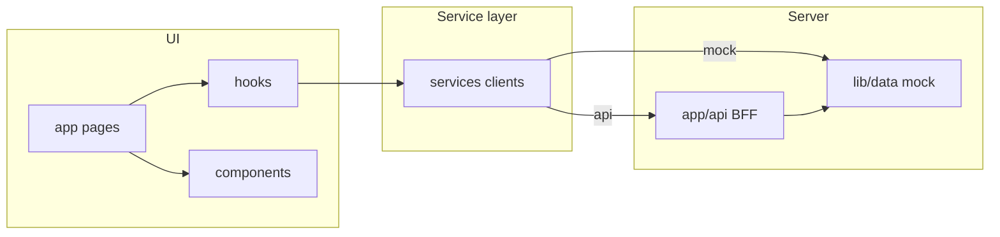

# Frontend production readiness

## Status: integration-ready (frontend)

The UI is structured for production **integration** with a real backend. Mock auth and mock data remain until Supabase and the ML API are connected.

| Area | Status | Notes |
|------|--------|--------|
| Component architecture | Ready | Presentational components; pages use hooks |
| Service layer (microservices pattern) | Ready | 6 clients with mock + API modes |
| BFF (`app/api/*`) | Ready | Stubs return mock data; swap handlers for DB/ML |
| TypeScript domain types | Ready | `types/`, `types/auth.ts` |
| Role-based access (coach/swimmer) | Ready | Client guard + `lib/access.ts` |
| Auth | Mock only | Replace with Supabase Auth before public launch |
| Real database | Not connected | Wire BFF routes |
| E2E / unit tests | Not included | Add before launch if required |

## Microservice-style clients (`services/`)

Each folder maps to a future backend capability:

| Client | Mock | API route | Future backend |
|--------|------|-----------|----------------|
| `auth` | `auth.mock.ts` | `/api/auth/*` | Supabase Auth |
| `swimmers` | `swimmers.mock.ts` | `/api/swimmers` | Dashboard DB |
| `sessions` | `sessions.mock.ts` | `/api/sessions` | Dashboard DB |
| `ml-analysis` | `ml-analysis.mock.ts` | `/api/sessions/:id/ml-results` | Python ML |
| `historical` | `historical.mock.ts` | `/api/swimmers/:id/history` | Dashboard DB |
| `team-metrics` | `team-metrics.mock.ts` | `/api/team-metrics` | Aggregations |

Switch provider: `NEXT_PUBLIC_DATA_PROVIDER=mock|api` in `.env.local`.

## Components (`components/`)

```
components/
  auth/       LoginForm, SignUpForm, AuthGuard
  layout/     Sidebar, TopBar, DashboardLayout
  dashboard/  StrokeScoreCards, SimpleSwimmerList, QualityChart, …
  session/    SimpleSessionAnalysis, QualityGauge, …
  ui/         LoadingState, ErrorState, EmptyState, Badge, ProgressBar
```

**Rule:** Pages and feature components do not import `@/lib/data`. Data flows:

```
Page → hook → service → (mock | BFF) → data
Page → props → presentational component
```

## Data flow



## Pre-launch checklist (backend team)

- [ ] Replace `app/api/auth/*` with Supabase Auth + httpOnly cookies
- [ ] Replace swimmer/session BFF handlers with Supabase dashboard DB
- [ ] Replace `ml-results` handler with Python ML service or stored results
- [ ] Enforce `coachId` / `swimmerId` filters in BFF (not only client)
- [ ] Remove or secure demo accounts in `lib/mock-auth.ts`
- [ ] Set production env vars (no secrets in `NEXT_PUBLIC_*`)
- [ ] Add monitoring, error tracking (e.g. Sentry)

## Build

```bash
npm run build
npm start
```
